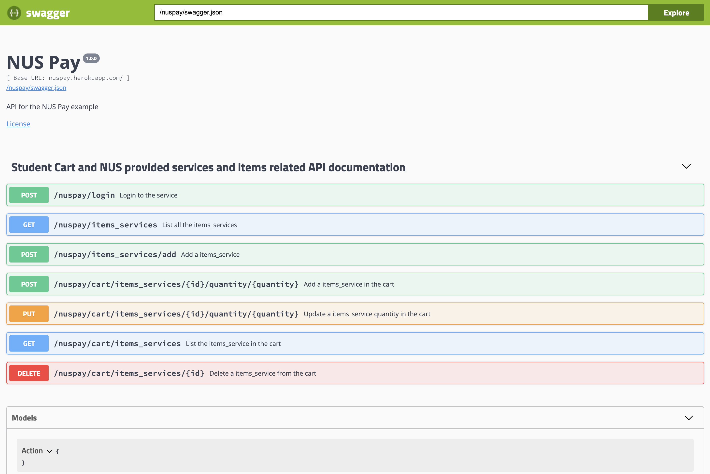
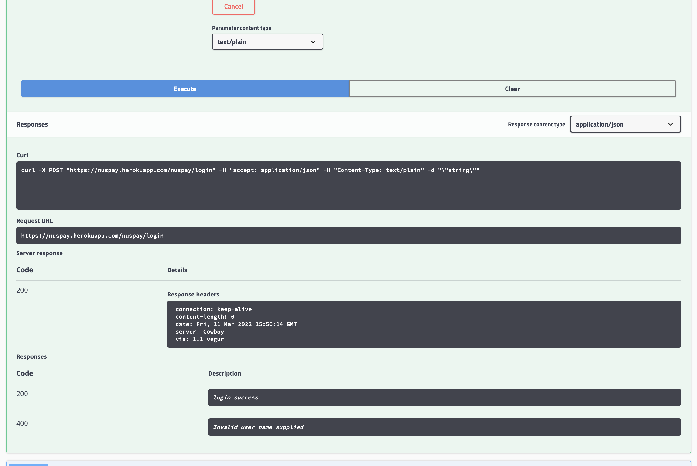
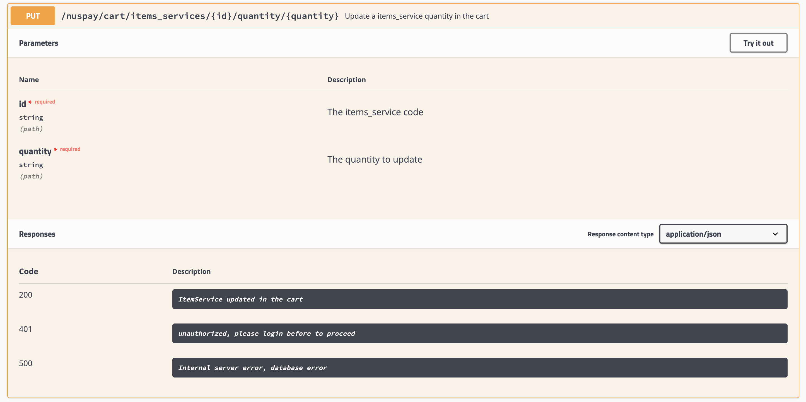
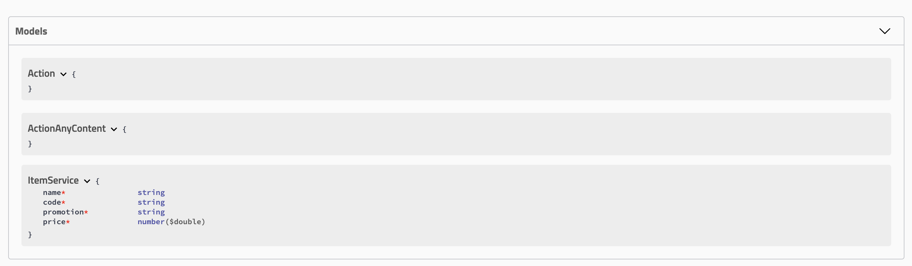

<h1 align="center">

   
  
   
  A one stop solution for NUS Payments and facility Bookings
   
   

# By: Prateek Manocha (A0228523H) and Ramesht Shukla (A0228506E)
# NUS-Pay
IT5100A Project using Scala. NUSPay: One stop payment solution for all NUS fraternity.
With NUSPay, we target to solve all financial related problems by making a single stop wallet in integration with our NUS ID to allow integration with platforms such as NSWS, Reboks, Payments at food stalls using ID card/uNivUS and allowing facilities such as account top-up, credits, promotions and many more.
  
# Libraries Used 
- slick
- Future
- ScalaTest
- Swagger
  
## View the SWAGGER API specs
 
## Main Page

  
## API Execute

## API_model

  
## Scala Models
 
  
## SWAGGER API [LINK](https://nuspay.herokuapp.com/docs/swagger-ui/index.html?url=/nuspay/swagger.json#/Student_Cart_and_NUS_provided_services_and_items_related_API_documentation/updateCartItemService) 

 

